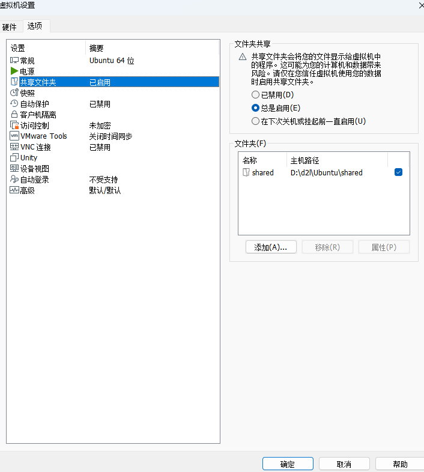

## 设置共享文件夹



## 挂载

创建挂载文件夹

```sh
mkdir /mnt/hgfs
```

挂载

```sh
/usr/bin/vmhgfs-fuse .host:/ /mnt/hgfs -o allow_other -o uid=0 -o gid=0 -o umask=022
```

## 永久挂载

提升文件权限

```sh
chmod 777 /etc/fstab
```

文件尾行添加内容

```sh
echo ".host:/ /mnt/hgfs fuse.vmhgfs-fuse allow_other,uid=0,gid=0,umask=022 0 0" >> /etc/fstab
```

## 添加快捷方式

```sh
ln -s /mnt/hgfs/${文件夹名称} /home/${username}/桌面
```


