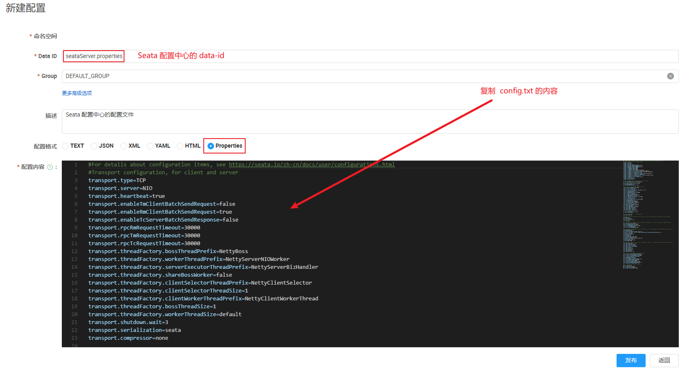

## Docker拉取

```sh
docker pull seataio/seata-server
```

## 配置

### 数据库配置

https://gitcode.com/seata/seata/blob/1.7.1/script/server/db/mysql.sql?init=initRepo

查看数据库sql，并创建数据库seata

```mysql
-- -------------------------------- The script used when storeMode is 'db' --------------------------------
-- the table to store GlobalSession data
CREATE TABLE IF NOT EXISTS `global_table`
(
    `xid`                       VARCHAR(128) NOT NULL,
    `transaction_id`            BIGINT,
    `status`                    TINYINT      NOT NULL,
    `application_id`            VARCHAR(32),
    `transaction_service_group` VARCHAR(32),
    `transaction_name`          VARCHAR(128),
    `timeout`                   INT,
    `begin_time`                BIGINT,
    `application_data`          VARCHAR(2000),
    `gmt_create`                DATETIME,
    `gmt_modified`              DATETIME,
    PRIMARY KEY (`xid`),
    KEY `idx_status_gmt_modified` (`status` , `gmt_modified`),
    KEY `idx_transaction_id` (`transaction_id`)
) ENGINE = InnoDB
  DEFAULT CHARSET = utf8mb4;

-- the table to store BranchSession data
CREATE TABLE IF NOT EXISTS `branch_table`
(
    `branch_id`         BIGINT       NOT NULL,
    `xid`               VARCHAR(128) NOT NULL,
    `transaction_id`    BIGINT,
    `resource_group_id` VARCHAR(32),
    `resource_id`       VARCHAR(256),
    `branch_type`       VARCHAR(8),
    `status`            TINYINT,
    `client_id`         VARCHAR(64),
    `application_data`  VARCHAR(2000),
    `gmt_create`        DATETIME(6),
    `gmt_modified`      DATETIME(6),
    PRIMARY KEY (`branch_id`),
    KEY `idx_xid` (`xid`)
) ENGINE = InnoDB
  DEFAULT CHARSET = utf8mb4;

-- the table to store lock data
CREATE TABLE IF NOT EXISTS `lock_table`
(
    `row_key`        VARCHAR(128) NOT NULL,
    `xid`            VARCHAR(128),
    `transaction_id` BIGINT,
    `branch_id`      BIGINT       NOT NULL,
    `resource_id`    VARCHAR(256),
    `table_name`     VARCHAR(32),
    `pk`             VARCHAR(36),
    `status`         TINYINT      NOT NULL DEFAULT '0' COMMENT '0:locked ,1:rollbacking',
    `gmt_create`     DATETIME,
    `gmt_modified`   DATETIME,
    PRIMARY KEY (`row_key`),
    KEY `idx_status` (`status`),
    KEY `idx_branch_id` (`branch_id`),
    KEY `idx_xid` (`xid`)
) ENGINE = InnoDB
  DEFAULT CHARSET = utf8mb4;

CREATE TABLE IF NOT EXISTS `distributed_lock`
(
    `lock_key`       CHAR(20) NOT NULL,
    `lock_value`     VARCHAR(20) NOT NULL,
    `expire`         BIGINT,
    primary key (`lock_key`)
) ENGINE = InnoDB
  DEFAULT CHARSET = utf8mb4;

INSERT INTO `distributed_lock` (lock_key, lock_value, expire) VALUES ('AsyncCommitting', ' ', 0);
INSERT INTO `distributed_lock` (lock_key, lock_value, expire) VALUES ('RetryCommitting', ' ', 0);
INSERT INTO `distributed_lock` (lock_key, lock_value, expire) VALUES ('RetryRollbacking', ' ', 0);
INSERT INTO `distributed_lock` (lock_key, lock_value, expire) VALUES ('TxTimeoutCheck', ' ', 0);
```

### 创建配置文件夹

```sh
mkdir -p /home/${username}/docker/seata/resources
```

### 启动临时容器获取配置文件后删除临时容器

```sh
docker run -d -p 8091:8091 -p 7091:7091  --name seata-server seataio/seata-server

docker cp seata-server:/seata-server/resources/. /home/${username}/docker/seata/resources

docker rm -f seata-server
```

### 修改application.yml配置文件

```yaml
seata:
  # 配置中心-nacos
  config:
    # support: nacos, consul, apollo, zk, etcd3
    type: nacos  
    nacos:
      server-addr: ${nacos_ip}:8848
      namespace:
      group: DEFAULT_GROUP
      username: nacos
      password: nacos
      context-path:
      data-id: seataServer.properties
  # 注册中心-nacos
  registry:
    # support: nacos, eureka, redis, zk, consul, etcd3, sofa
    type: nacos  
    nacos:
      application: seata-server
      server-addr: ${nacos_ip}:8848
      group: DEFAULT_GROUP
      namespace:
      cluster: default    # TC 集群名称
      username: nacos
      password: nacos
```

### 导入Nacos配置文件

https://gitcode.com/seata/seata/blob/2.x/script/config-center/config.txt?init=initRepo

找到对应版本的配置文件

需要配置ip + 端口 + 用户名 + 密码

```properties
#For details about configuration items, see https://seata.io/zh-cn/docs/user/configurations.html
#Transport configuration, for client and server
transport.type=TCP
transport.server=NIO
transport.heartbeat=true
transport.enableTmClientBatchSendRequest=false
transport.enableRmClientBatchSendRequest=true
transport.enableTcServerBatchSendResponse=false
transport.rpcRmRequestTimeout=30000
transport.rpcTmRequestTimeout=30000
transport.rpcTcRequestTimeout=30000
transport.threadFactory.bossThreadPrefix=NettyBoss
transport.threadFactory.workerThreadPrefix=NettyServerNIOWorker
transport.threadFactory.serverExecutorThreadPrefix=NettyServerBizHandler
transport.threadFactory.shareBossWorker=false
transport.threadFactory.clientSelectorThreadPrefix=NettyClientSelector
transport.threadFactory.clientSelectorThreadSize=1
transport.threadFactory.clientWorkerThreadPrefix=NettyClientWorkerThread
transport.threadFactory.bossThreadSize=1
transport.threadFactory.workerThreadSize=default
transport.shutdown.wait=3
transport.serialization=seata
transport.compressor=none

#Transaction routing rules configuration, only for the client
service.vgroupMapping.default_tx_group=default
#If you use a registry, you can ignore it
service.default.grouplist=127.0.0.1:8091
service.enableDegrade=false
service.disableGlobalTransaction=false

#Transaction rule configuration, only for the client
client.rm.asyncCommitBufferLimit=10000
client.rm.lock.retryInterval=10
client.rm.lock.retryTimes=30
client.rm.lock.retryPolicyBranchRollbackOnConflict=true
client.rm.reportRetryCount=5
client.rm.tableMetaCheckEnable=true
client.rm.tableMetaCheckerInterval=60000
client.rm.sqlParserType=druid
client.rm.reportSuccessEnable=false
client.rm.sagaBranchRegisterEnable=false
client.rm.sagaJsonParser=fastjson
client.rm.tccActionInterceptorOrder=-2147482648
client.tm.commitRetryCount=5
client.tm.rollbackRetryCount=5
client.tm.defaultGlobalTransactionTimeout=60000
client.tm.degradeCheck=false
client.tm.degradeCheckAllowTimes=10
client.tm.degradeCheckPeriod=2000
client.tm.interceptorOrder=-2147482648
client.undo.dataValidation=true
client.undo.logSerialization=jackson
client.undo.onlyCareUpdateColumns=true
server.undo.logSaveDays=7
server.undo.logDeletePeriod=86400000
client.undo.logTable=undo_log
client.undo.compress.enable=true
client.undo.compress.type=zip
client.undo.compress.threshold=64k
#For TCC transaction mode
tcc.fence.logTableName=tcc_fence_log
tcc.fence.cleanPeriod=1h

#Log rule configuration, for client and server
log.exceptionRate=100

#Transaction storage configuration, only for the server. The file, db, and redis configuration values are optional.
store.mode=db
store.lock.mode=db
store.session.mode=db
#Used for password encryption
store.publicKey=

#If `store.mode,store.lock.mode,store.session.mode` are not equal to `file`, you can remove the configuration block.
store.file.dir=file_store/data
store.file.maxBranchSessionSize=16384
store.file.maxGlobalSessionSize=512
store.file.fileWriteBufferCacheSize=16384
store.file.flushDiskMode=async
store.file.sessionReloadReadSize=100

#These configurations are required if the `store mode` is `db`. If `store.mode,store.lock.mode,store.session.mode` are not equal to `db`, you can remove the configuration block.
store.db.datasource=druid
store.db.dbType=mysql
store.db.driverClassName=com.mysql.jdbc.Driver
#需要配置ip + 端口 + 用户名 + 密码
store.db.url=jdbc:mysql://${IP+端口}/seata?useUnicode=true&rewriteBatchedStatements=true
store.db.user=root
store.db.password=123456
store.db.minConn=5
store.db.maxConn=30
store.db.globalTable=global_table
store.db.branchTable=branch_table
store.db.distributedLockTable=distributed_lock
store.db.queryLimit=100
store.db.lockTable=lock_table
store.db.maxWait=5000

#These configurations are required if the `store mode` is `redis`. If `store.mode,store.lock.mode,store.session.mode` are not equal to `redis`, you can remove the configuration block.
store.redis.mode=single
store.redis.single.host=127.0.0.1
store.redis.single.port=6379
store.redis.sentinel.masterName=
store.redis.sentinel.sentinelHosts=
store.redis.maxConn=10
store.redis.minConn=1
store.redis.maxTotal=100
store.redis.database=0
store.redis.password=
store.redis.queryLimit=100

#Transaction rule configuration, only for the server
server.recovery.committingRetryPeriod=1000
server.recovery.asynCommittingRetryPeriod=1000
server.recovery.rollbackingRetryPeriod=1000
server.recovery.timeoutRetryPeriod=1000
server.maxCommitRetryTimeout=-1
server.maxRollbackRetryTimeout=-1
server.rollbackRetryTimeoutUnlockEnable=false
server.distributedLockExpireTime=10000
server.xaerNotaRetryTimeout=60000
server.session.branchAsyncQueueSize=5000
server.session.enableBranchAsyncRemove=false
server.enableParallelRequestHandle=false

#Metrics configuration, only for the server
metrics.enabled=false
metrics.registryType=compact
metrics.exporterList=prometheus
metrics.exporterPrometheusPort=9898

```



## 启动

```sh
docker run -d \
    --name seata \
    --restart=always \
    -p 8091:8091 \
    -p 7091:7091 \
    -e SEATA_IP=${ip不需要端口} \
    -v /opt/seata/config:/seata-server/resources \
    seataio/seata-server:1.7.1
```

## 坑点

- jdk需要1.8，高版本17报错

- seata版本1.7.1可行，高版本报错

## SpringBoot配置

```yaml
seata:
  enabled: true
  # 事务组的名称，对应service.vgroupMapping.default_tx_group=xxx中配置的default_tx_group
  tx-service-group: default_tx_group  # 需要与下方一致
  # 配置事务组与集群的对应关系
  service:
    vgroup-mapping:
      # default_tx_group为事务组的名称，default为集群名称(与registry.conf中的一致)
      default_tx_group: default  # 需要与上方一致
    disable-global-transaction: false
  registry:
    type: nacos
    nacos:
      application: seata-server
      server-addr: ${eblog.cloud.nacos.server-addr}
      group: DEFAULT_GROUP
      namespace: ""
      username: nacos
      password: nacos
      # registry.conf中，配置cluster名称
      cluster: default
  data-source-proxy-mode: XA
```

## 使用AT模式

需要在每个RM数据库中添加undolog

```sql
SET NAMES utf8mb4;
SET FOREIGN_KEY_CHECKS = 0;

-- ----------------------------
-- Table structure for undo_log
-- ----------------------------
DROP TABLE IF EXISTS `undo_log`;
CREATE TABLE `undo_log`  (
  `branch_id` bigint(20) NOT NULL COMMENT '分支事务ID',
  `xid` varchar(100) CHARACTER SET utf8 COLLATE utf8_general_ci NOT NULL COMMENT '全局事务ID',
  `context` varchar(128) CHARACTER SET utf8 COLLATE utf8_general_ci NOT NULL COMMENT '上下文',
  `rollback_info` longblob NOT NULL COMMENT '回滚信息',
  `log_status` int(11) NOT NULL COMMENT '状态，0正常，1全局已完成',
  `log_created` datetime(6) NOT NULL COMMENT '创建时间',
  `log_modified` datetime(6) NOT NULL COMMENT '修改时间',
  UNIQUE INDEX `ux_undo_log`(`xid`, `branch_id`) USING BTREE
) ENGINE = InnoDB CHARACTER SET = utf8 COLLATE = utf8_general_ci COMMENT = 'AT transaction mode undo table' ROW_FORMAT = Compact;

SET FOREIGN_KEY_CHECKS = 1;
```

然后修改springboot的application.yml

```yaml
data-source-proxy-mode: AT
```

